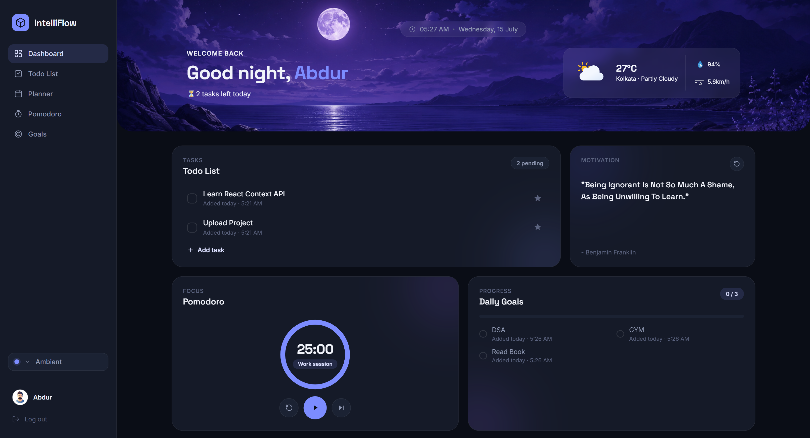
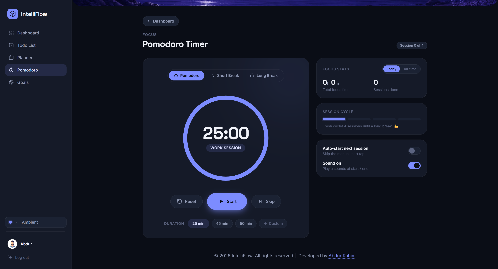

# 🌊 Flow | Modern Productivity Dashboard

Flow is a premium, beautifully designed Single-Page Application (SPA) built entirely with Vanilla JavaScript, HTML, and CSS. Designed to serve as a comprehensive productivity hub, it combines task management, time tracking, daily planning, and dynamic environmental widgets into one seamless, glassmorphic UI. 

This project was engineered from the ground up without frameworks to deeply explore state management, DOM manipulation, and multi-tenant local storage architecture.

---

## 📸 Interface Gallery

<!-- 
  REPLACE THE '#' LINKS BELOW WITH YOUR ACTUAL SCREENSHOT URLS 
  (e.g., ./assets/screenshots/main-dashboard.png)
-->

### The Dashboard

*The main hub featuring the bento-box grid design, weather data, and dynamic greeting.*

### Authentication & Multi-Tenancy

*Secure, isolated data environments for different users with a modern glassmorphism login UI.*

### Deep Focus & Planning

*Dedicated SPA views for the Pomodoro timer and the 24-hour daily schedule.*

---

## ✨ Key Features

*   **Multi-Tenant Authentication:** A custom-built client-side auth system using `localStorage`. Each registered user gets their own isolated data sandbox (Todos, Goals, Planner, Pomodoro stats) seamlessly prefix-mapped to their session.
*   **Time-Synced Ambient Themes:** The UI automatically adapts its CSS custom properties (Morning, Afternoon, Evening, Night) and dynamic greetings based on the user's real-time local clock.
*   **Single-Page Application (SPA) Routing:** Fluid, instant navigation between the dashboard and full-screen feature views without page reloads.
*   **Dynamic Data Widgets:** Integrated with external APIs to fetch real-time location-based weather, temperature, wind speed, and daily motivational quotes.
*   **Interactive Bento Grid:**
    *   **Todo List:** Complete CRUD functionality with "Important" and "Completed" filtering tabs.
    *   **Daily Goals:** Momentum tracking with dynamic SVG progress rings.
    *   **Pomodoro Timer:** Custom durations, session cycle tracking, and auto-start logic with audio cues.
    *   **Daily Planner:** A 24-hour timeline with a dynamic, real-time "now" tracking line.

---

## 🧠 Technical Learnings & Architecture

Building this project without a framework like React or Vue was a deliberate choice to master the fundamentals of web architecture. Key takeaways include:

1.  **State Management & Data Persistence:** Engineered a robust `localStorage` wrapper that mimics a backend database, securely handling user creation, session pointers, and namespaced data retrieval.
2.  **Event Delegation:** Optimized performance by attaching single event listeners to parent containers (like the navigation menu and task lists) rather than binding thousands of individual listeners to child nodes.
3.  **Advanced CSS Architecture:** Implemented a scalable CSS variable (Custom Properties) system to handle global theme switching effortlessly, alongside complex `stroke-dashoffset` math for dynamic SVG progress rings.
4.  **Asynchronous JavaScript:** Utilized `async/await` and `Promise.all()` to fetch reverse-geocoding and weather data concurrently, ensuring the UI populates instantly.

### 📐 Data Flow & Architecture

Below is the Excalidraw mapping of the application's data flow, illustrating how the Auth Gatekeeper assigns session pointers and routes to the namespaced local storage.

<!-- REPLACE '#' WITH EXCALIDRAW SCREENSHOT URL -->

---

## Thank you for checking out IntelliFlow! Your feedback is invaluable in making IntelliFlow the ultimate productivity dashboard.